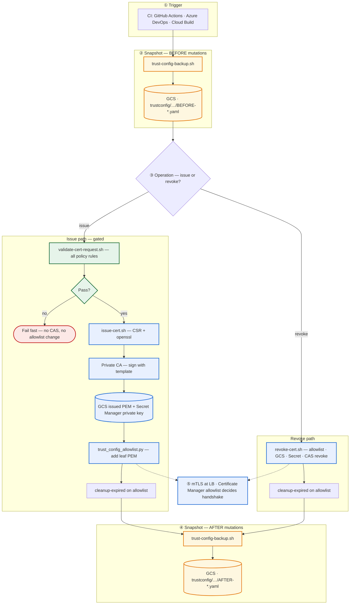
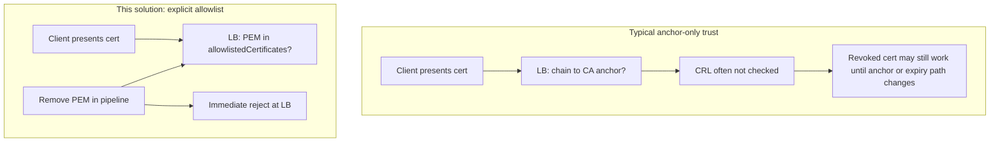
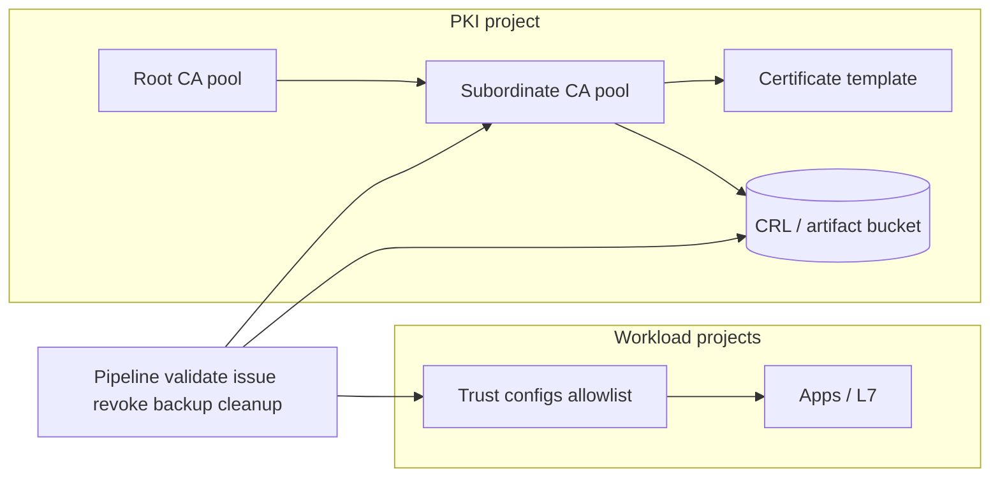

# GCP CAS Enterprise Client mTLS Lifecycle

**Repository:** `gcp-cas-enterprise-mtls`

---

## What makes this different from “just CAS + mTLS”?

A **typical** Google Cloud setup stops at Terraform for **Certificate Authority Service**: root/sub CA, pools, templates, maybe a CRL bucket. **Client certificates still appear ad hoc**—CSRs by hand, weak or missing policy checks, and **trust configs that only pin a CA (trust anchor)**.

This solution’s focus is **full lifecycle automation** so operations stay repeatable, auditable, and safe at the load balancer:

| Pillar | What you get |
|--------|----------------|
| **Pre-issuance validation** | Rules run **before** any CAS call: app allow-list, **OU = `<env>-<app>`**, **CN** must contain env token, charset/length, lifetime min/max, **stricter caps for prod-like envs**, and a **maintenance / blackout window** on certificate `notAfter`. Fail fast in CI (`validate-cert-request.sh`). |
| **Easy issue path** | One pipeline run: parameters → validate → **key + CSR** (`openssl`) → **CAS** sign with template → PEM to **GCS**, private key to **Secret Manager** (`issue-cert.sh`). |
| **Revoke + deprovision in one flow** | **`revoke-cert.sh`**: remove PEM from **allowlist**, delete GCS copy, delete Secret, **CAS revoke** for audit trail, then **expired-certificate cleanup** on the allowlist. |
| **Allowlist vs trust anchor (the LB problem)** | Many **HTTPS / external load balancers do not check CRLs** for client certs. With **anchor-only** trust, *any* valid cert from your CA may still be accepted until expiry. Here, **Certificate Manager** carries **`allowlistedCertificates`**; the LB checks the **concrete leaf PEM list**. **Remove the entry → access drops immediately** (e.g. handshake / 403), without waiting on CRL behavior. |
| **Allowlist backups** | Every run **exports trust config YAML** to GCS **before** and **after** (`trust-config-backup.sh`), under `trustconfig/{app}-{env}/BEFORE|AFTER-*.yaml`, for rollback and audit. |
| **Automatic cleanup** | **`trust_config_allowlist.py cleanup-expired`** drops **expired** PEMs from the allowlist on each successful issue/revoke path so lists stay healthy. |
| **Automation everywhere** | Same stages in **Azure DevOps**, **GitHub Actions** (including a **reusable** workflow), and **Cloud Build**—not a one-off script collection. |

**Terraform** still provisions the **PKI foundation** (pools, CAs, template, CRL bucket, lifecycle IAM). The **differentiator** is the **closed loop**: *validate → issue/revoke → mutating allowlist + backups + cleanup*, aligned with how enterprises actually run mTLS.

---

### End-to-end automation (one pipeline run)

Full lifecycle from **trigger** through **policy**, **CAS / artifacts / allowlist**, **audited YAML snapshots**, and **load balancer enforcement**. Same stage logic on **GitHub Actions**, **Azure DevOps**, and **Cloud Build** ([`docs/pipeline.md`](docs/pipeline.md)).

**Test mode:** validation and read-only checks still run; **CAS**, **GCS**, **Secret Manager**, and **allowlist** mutations are skipped (see [`docs/pipeline.md`](docs/pipeline.md)).

---

### Diagram: trust anchor vs allowlist at load balancer

See also [docs/trust-config.md](docs/trust-config.md) and [docs/architecture.md](docs/architecture.md).

---

### Diagram: automation scope (high level)

---

## Who this helps

- Teams rolling out **internal mTLS** without public CA issuance for private names.
- Organizations that want **PKI in a dedicated project** and **per-app / per-env** trust in **Certificate Manager**, with **automated** issuance and revocation.
- Groups that need **policy before every cert**, **pipeline-driven** CSR/issue, **allowlist backups**, and **immediate** LB-level effect when revoking.

---

## Repository layout

| Path | Role |
|------|------|
| `terraform/` | CA pools, CAs, CRL bucket, client template, lifecycle SA, API enables (**PKI foundation**). |
| `scripts/` | **Validation**, issue/revoke, backups, **allowlist YAML** tool (`trust_config_allowlist.py`), Cloud Build driver. |
| `cicd/` | Azure DevOps caller + template (**pre-validate-issue/revoke-post** + allowlist steps). |
| `.github/workflows/` | Manual + **reusable** workflows (same lifecycle). |
| `cloudbuild/` | Cloud Build parity. |
| `docs/` | Architecture, **allowlist lifecycle**, trust model, pipeline diagrams. |
| `.gitignore` | Root + `terraform/.gitignore` for secrets and state. |

---

## Setup and use

**Full guide:** **[docs/setup-and-use.md](docs/setup-and-use.md)** — Terraform, `GCP_SA_KEY` / WIF, local validation, GitHub Actions, Azure DevOps, and Cloud Build.

**Terraform (summary):** copy `terraform/terraform.tfvars.example` → `terraform/terraform.tfvars`; set **`crl_bucket_name`** (globally unique) and **`trust_config_admin_folder_ids`** (or grant Certificate Manager separately); then `terraform init`, `plan`, `apply`.

**Pipelines (summary):** GitHub — **Actions → GCP CAS Enterprise mTLS lifecycle** + **`cert-lifecycle-reusable.yaml`** ([docs/pipeline.md](docs/pipeline.md)); Cloud Build — `gcloud builds submit --config=cloudbuild/cert-lifecycle.yaml`; ADO — `cicd/cas-cert-workflow.yaml` + template. Use **test mode** until sandbox succeeds. **Python:** allowlist tool needs **PyYAML** (`scripts/requirements.txt`).

---

## Validation rules (issue path)

`scripts/validate-cert-request.sh`: application **allow-list**, **OU** = `<env>-<app>`, **CN** contains env token, **length/charset**, lifetime **min/max** and **`STRICT_VALIDITY_ENVS`** (comma list of env labels that use the stricter max; e.g. `prod`), **maintenance window** on `notAfter`. **Nothing hits CAS until this passes.**

---

## Trust config naming (allowlist)

Default id: **`trust-config-<workloadApp>-<workloadEnv>`**. Override with **`TRUST_CONFIG_NAME`** / **`trustConfigName`**. See [docs/allowlist-lifecycle.md](docs/allowlist-lifecycle.md).

---

## Before production

Review with security and platform teams: **Secret Manager** usage, IAM in `cert-lifecycle-iam.tf`, bucket **retention**, **deletion protection**, **monitoring**, pinned **`gcloud`/Terraform**, and alerts on **out-of-band** trust config changes.

---

## Documentation (read in this order for the “why”)

| Document | Contents |
|----------|-----------|
| [docs/diagrams.md](docs/diagrams.md) | **Diagram gallery**: positioning, CI matrix, issue/revoke state machines, validation gate, artifacts, recovery (README also has **end-to-end automation** above). |
| [docs/setup-and-use.md](docs/setup-and-use.md) | **Step-by-step setup and run** (Terraform, CI, local validate). |
| [docs/terraform.md](docs/terraform.md) | **Terraform** file layout, dependency graph, enterprise practices, outputs → pipelines. |
| [docs/architecture.md](docs/architecture.md) | System context, **issuance sequence**, LB enforcement. |
| [docs/allowlist-lifecycle.md](docs/allowlist-lifecycle.md) | **Allowlist model**, pipelines, recovery. |
| [docs/trust-config.md](docs/trust-config.md) | **Anchor vs allowlist** and trust flow. |
| [docs/pipeline.md](docs/pipeline.md) | **Stage diagram**, parameters, ADO / GitHub / Cloud Build. |

---

## Scope

This solution covers **CAS**, **allowlist trust configs**, **client mTLS lifecycle automation**, and **multi-CI** runners. Broader landing zones and formal certifications are **out of scope**—bring those from your platform baseline.