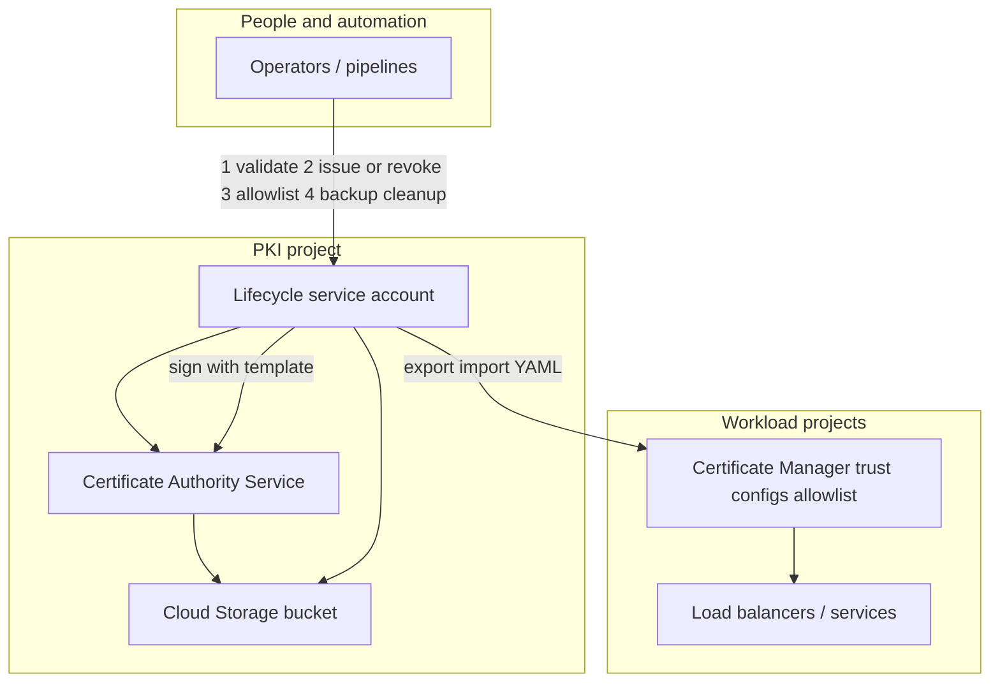
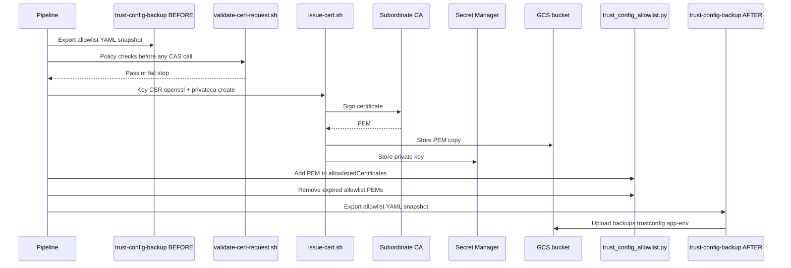
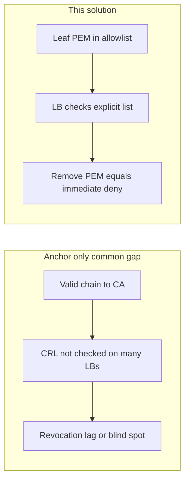

# Architecture

How the **GCP CAS Enterprise Client mTLS Lifecycle** is structured—and how it **extends** a plain Certificate Authority Service deployment.

---

## Beyond “Terraform + CAS only”

| Plain CAS / mTLS baseline | What this solution adds |
|---------------------------|-------------------------|
| CA pools, template, CRL bucket in code | Same **Terraform** foundation (see `terraform/`). |
| Manual CSRs and ad hoc issuance | **Pipeline-driven** issue path: validate → **openssl** key+CSR → **gcloud privateca** → GCS + Secret Manager. |
| Trust config with **CA anchor only** | **Allowlisted leaf PEMs** + automation to **add/remove** entries so the **load balancer** enforces **explicit** trust (see below). |
| CRL as primary revocation story for LBs | Many **external LBs do not check CRLs** for client certs; **shrinking the allowlist** revokes **at handshake** without depending on that behavior. |
| No standard backup of trust state | **BEFORE/AFTER** YAML export to GCS on **every** run. |
| Stale certs on allowlist | **Expired-entry cleanup** after issue/revoke. |
| Informal policy | **Central validation script** gates issuance (**OU, CN, lifetime, env rules, blackout window**). |

---

## Projects and responsibilities

- **PKI project:** CAS **pools**, **root/sub CAs**, **CRL / artifact bucket**, **certificate template**, **lifecycle service account**, **Secret Manager** usage for issued keys.
- **Workload projects:** **Certificate Manager trust configs** (here: **allowlist**-oriented), apps and load balancers that consume them.

“Where we sign” (PKI) vs “what the LB accepts” (per-app/env allowlist in workload projects).

---

## System context

---

## Issuance sequence (automation — the core story)

This sequence is what ties **validation**, **CAS**, **allowlist**, **backup**, and **cleanup** together:

Paths: `trustconfig/{app}-{env}/BEFORE|AFTER-*.yaml` — see [allowlist-lifecycle.md](allowlist-lifecycle.md).

---

## Load balancer enforcement: anchor vs allowlist

---

## IAM (high level)

| Principal | Scope | Role |
|-----------|--------|------|
| Lifecycle SA | Subordinate **pool** | Issue / manage end-entity certs. |
| Lifecycle SA | **Bucket** | PEM copies, **trust config YAML backups**. |
| Lifecycle SA | Optional **folders** | `certificatemanager.editor` for trust config import/export. |
| Lifecycle SA | **PKI project** | Secret Manager (narrow in production). |
| Private CA service agent | **Bucket** | CRL/CA publication material. |

---

## CRL bucket

Holds CRL-related objects **and** operational prefixes (`certificates/…`, `trustconfig/…`). Align **lifecycle rules** with retention and audit policy.

---

## Certificate template

**Pool** policy + **template** narrow **client-auth** profiles and optional **CEL** on SANs. Template is **not** a substitute for **pipeline validation** or **allowlist** enforcement at the LB.

Return to [README](../README.md).
