# Diagram gallery

Visual index for **GCP CAS Enterprise Client mTLS Lifecycle**. Use these in design reviews, onboarding decks, and architecture records.

---

## 1. Solution positioning (Terraform vs automation)

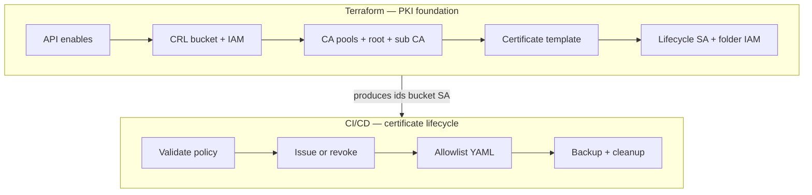

---

## 2. Multi-platform automation (same semantics)

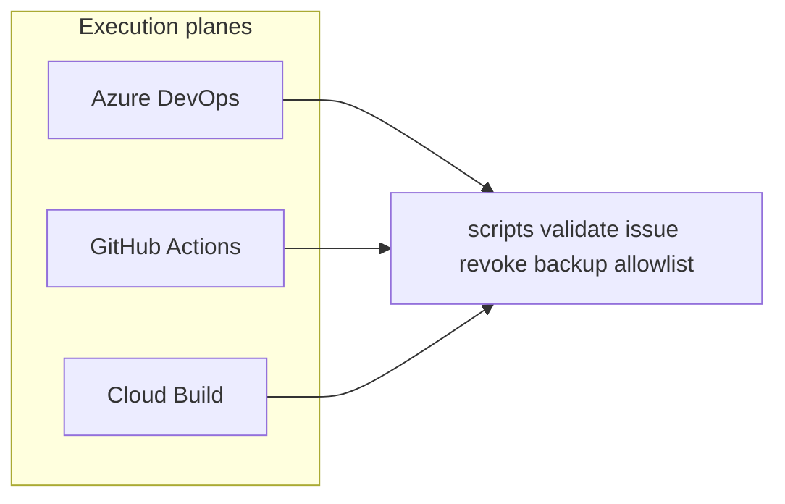

---

## 3. Issue path — decision / state flow

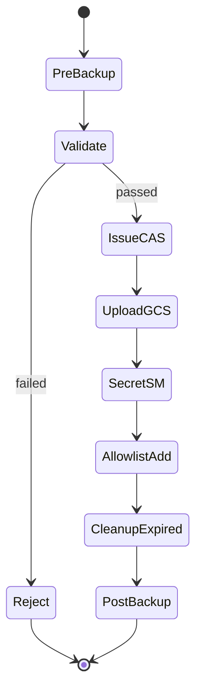

---

## 4. Revoke path — state flow

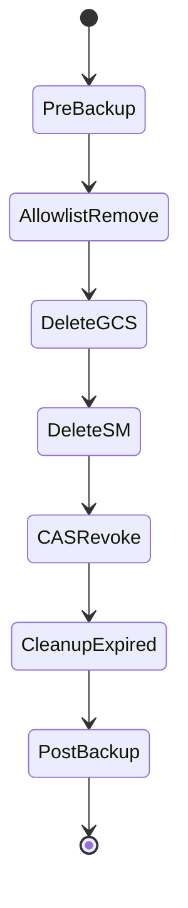

---

## 5. Validation gate (before CAS)

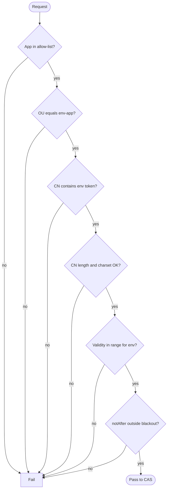

---

## 6. Data artifacts per issue

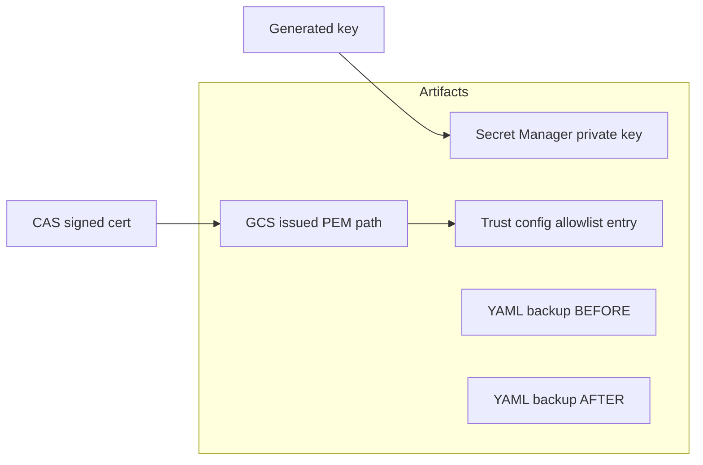

---

## 7. Per-app / per-env isolation

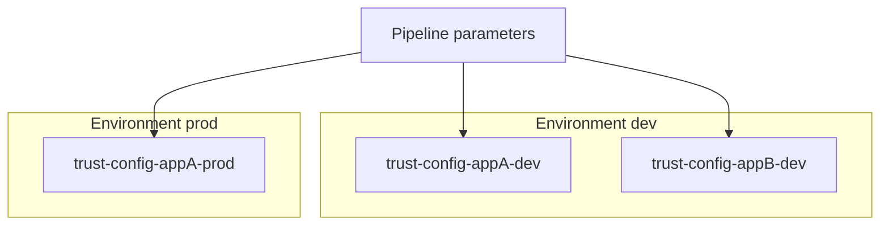

---

## 8. Allowlist vs anchor (enforcement)

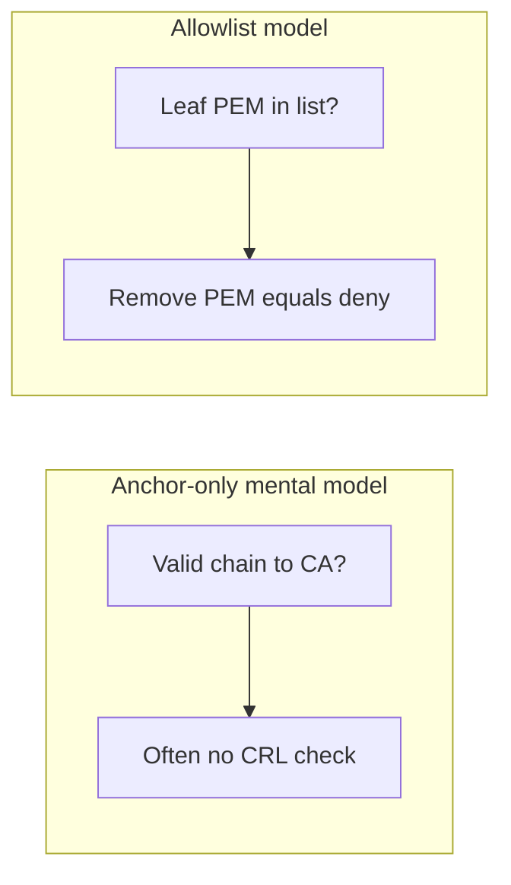

---

## 9. Recovery from backups

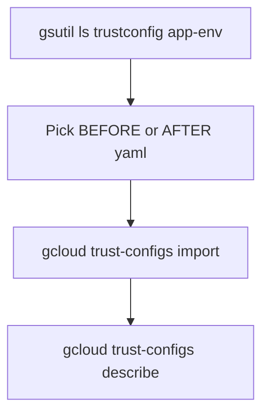

---

## 10. Operator journey (issue)

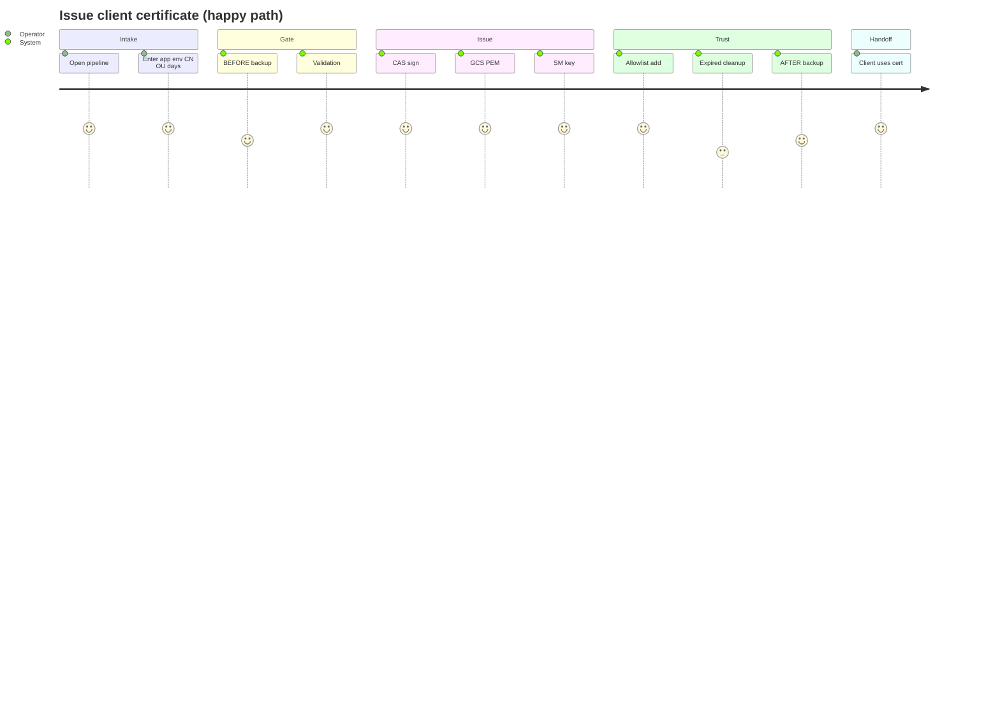

---

## 11. Terraform layering (conceptual)

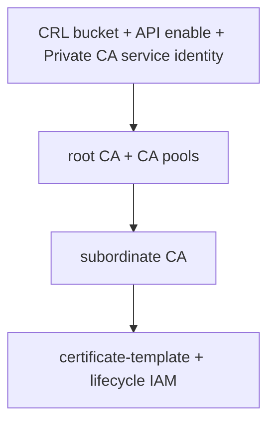

---

## 12. Failure containment

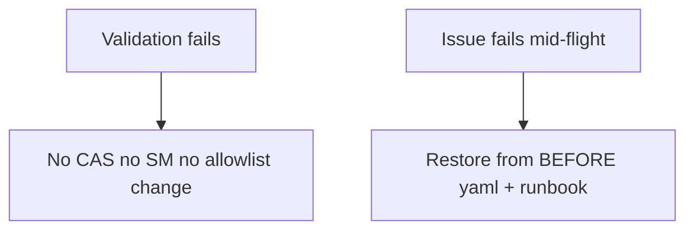

---

## 13. Audit artifacts per run

| Source | Examples |
|--------|-----------|
| **CI** | Azure DevOps run logs, GitHub Actions job logs, Cloud Build logs |
| **GCS** | `trustconfig/.../BEFORE-*.yaml`, `AFTER-*.yaml`, issued PEM paths |
| **GCP audit** | Cloud Audit Logs for CAS, Certificate Manager, Secret Manager |

---

Return to [README](../README.md) · [architecture.md](architecture.md) · [pipeline.md](pipeline.md) · [terraform.md](terraform.md)
