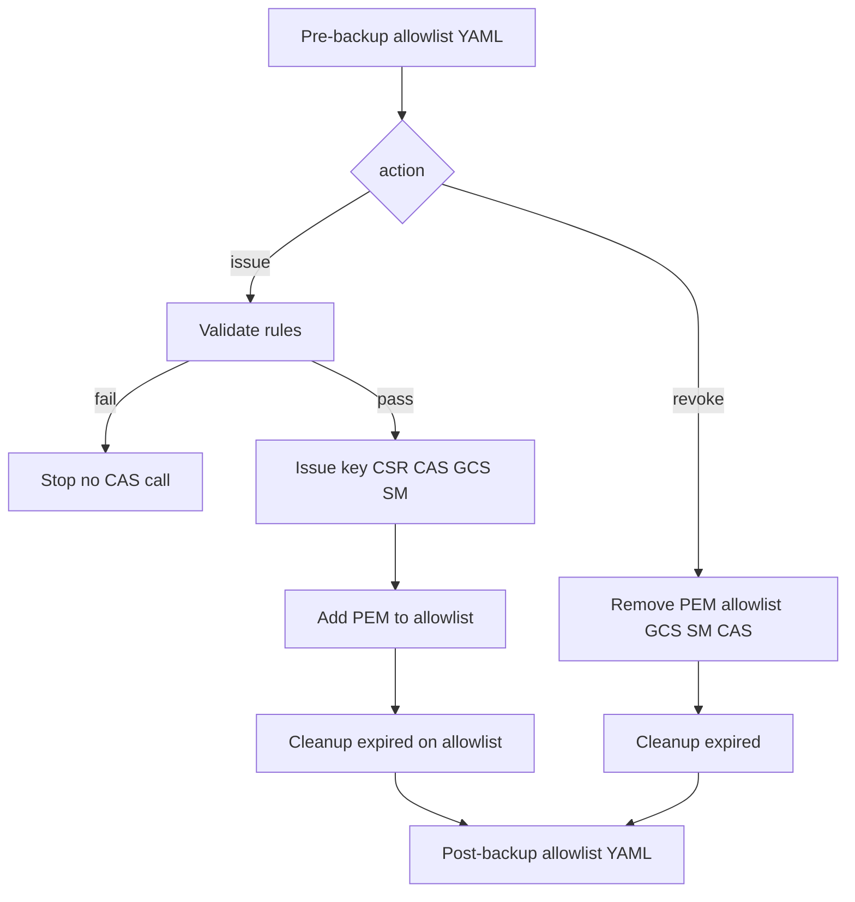

# Pipeline automation

This repository’s **differentiator** is **repeatable lifecycle**: **validate before CAS**, **issue or revoke** through one flow, **mutate Certificate Manager allowlist**, **backup YAML**, and **cleanup expired** entries—available on **Azure DevOps**, **GitHub Actions** (including **reusable** workflow), and **Cloud Build**.

---

## What the pipelines implement (highlight)

| Stage | Purpose |
|-------|---------|
| **Pre-backup** | **BEFORE** snapshot of trust config (allowlist) YAML to GCS — rollback point. |
| **Validate** (issue only) | **All policy rules** run here; **failure stops** the run before any certificate is issued. |
| **Issue** | Key + CSR (`openssl`) → **CAS** → GCS + Secret Manager → **add PEM to allowlist** → **cleanup expired** on list. |
| **Revoke** | Remove PEM from allowlist → delete GCS + Secret → **CAS revoke** → **cleanup expired**. |
| **Post-backup** | **AFTER** snapshot to GCS — audit and restore. |

Skipped branches are normal: only **issue** *or* **revoke** runs per execution.

---

## Files

- `cicd/cas-cert-workflow.yaml` — ADO caller: parameters + variables.
- `cicd/templates/cas-cert-lifecycle.yaml` — ADO stages (backup → validate → issue **or** revoke → backup + allowlist steps).
- `.github/workflows/cert-lifecycle.yaml` — `workflow_dispatch` → calls reusable workflow.
- `.github/workflows/cert-lifecycle-reusable.yaml` — `workflow_call` for reuse:  
  `uses: org/repo/.github/workflows/cert-lifecycle-reusable.yaml@ref` with matching `with` + `secrets: GCP_SA_KEY`.
- `cloudbuild/cert-lifecycle.yaml` — substitutions → `scripts/cloudbuild-lifecycle.sh`.

---

## Authentication

### Azure DevOps

Add your enterprise **Google Cloud** login (service connection, WIF, or short-lived key on the agent). Install **`gcloud`**, **`gsutil`**, **`openssl`** on the agent if needed.

### GitHub Actions

Default: **`google-github-actions/auth`** + **`GCP_SA_KEY`**. Prefer **Workload Identity Federation** in production ([auth action docs](https://github.com/google-github-actions/auth)).

### Cloud Build

Uses the **Cloud Build service account** (or `--service-account`): grant the same capability classes as your GitHub/ADO automation principal.

---

## Parameters (ADO / GitHub — same meaning)

| Parameter | Meaning |
|-----------|---------|
| `action` | `issue` or `revoke`. |
| `workloadApp` | Allow-listed application slug. |
| `workloadEnv` | Your org’s label (examples in this repo: `dev`, `sandbox`, `prod`). |
| `workloadProjectId` | Project hosting the **trust config**. |
| `trustConfigName` | Optional; default **`trust-config-{app}-{env}`**. |
| `commonName` / `organizationalUnit` / `validityDays` | CSR + policy (**issue**). |
| `certificateId` | **Revoke** target (`revoke-cert.sh` layout). |
| `testMode` | If true: **validation runs**; **mutations** to CAS/GCS/SM/allowlist are skipped (good for dry runs). |

**Allowlist automation:** after issue, **`trust_config_allowlist.py add`** then **`cleanup-expired`**. Revoke uses **`revoke-cert.sh`** (allowlist → GCS → SM → CAS → cleanup).

---

## Common failures

- **Trust config export fails:** Resource missing or wrong project — default name is **`trust-config-<app>-<env>`** (not `trustcfg-…`).
- **`gcloud privateca certificates create`:** Compare with current `--help`; **region** must match Terraform **`var.region`**.
- **Stricter env lifetime:** `maxValidityDaysProd` / `STRICT_VALIDITY_ENVS`.

---

## Test mode

- **ADO:** `True`/`False` normalized to `TEST_MODE` for bash.
- **GitHub:** boolean input mapped in each job.

---

## Hardening

- Approvals, environments, protected branches, pinned tool versions.

Return to [README](../README.md).
