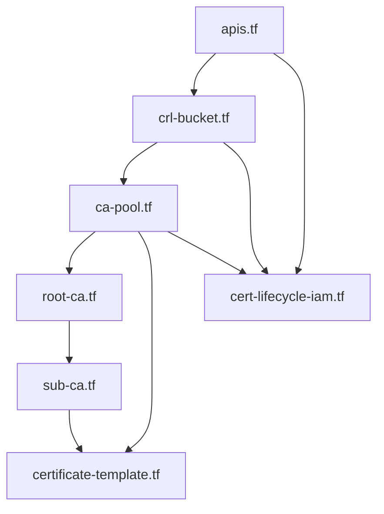

# Terraform layout and practices

How **GCP CAS Enterprise Client mTLS Lifecycle** structures infrastructure-as-code for **Certificate Authority Service**—kept **layered**, **explicit**, and **review-friendly**.

---

## Module layout (flat root module)

| File | Responsibility |
|------|----------------|
| `versions.tf` | Terraform **>= 1.6**, `hashicorp/google` and `google-beta` **>= 5.40, < 8**, default provider `project` / `region`. |
| `variables.tf` | Typed inputs; **no** environment-based `count` switches—always defines the single PKI stack. |
| `apis.tf` | **`google_project_service`** for `privateca`, `storage`, `secretmanager` with `disable_on_destroy = false`. |
| `data.tf` | `data.google_project.current` (project number for outputs/IAM). |
| `crl-bucket.tf` | **Private CA service identity** → **GCS bucket** (versioning, PAB, lifecycle) → **IAM** for publisher + automation. |
| `ca-pool.tf` | **Root** then **subordinate** pools; `depends_on` API + bucket IAM; sub pool **issuance policy** baseline. |
| `root-ca.tf` / `sub-ca.tf` | CA resources, CRL bucket binding, lifetimes, `deletion_protection`, subordinate → root link. |
| `certificate-template.tf` | Regional **client-auth** template; **CEL** optional; `depends_on` pool + API. |
| `cert-lifecycle-iam.tf` | Automation **service account**, pool IAM, bucket IAM, optional **folder** `certificatemanager.editor`. |
| `outputs.tf` | Pool id, sub CA name, template name, bucket, SA email, project number. |

---

## Design choices (enterprise-friendly)

- **Explicit API enablement** before service identities and CAS resources—avoids flaky first-time applies in greenfield projects.
- **Provider split**: `google-beta` only where required (e.g. project service identity for Private CA); primary resources on `google`.
- **`deletion_protection`** on CAs defaults **on**—break-glass is deliberate.
- **Bucket**: uniform access, **PAB enforced**, versioning for tamper-evident object history; **lifecycle** documented as optional cost/retention trade-off (tune per audit).
- **Labels** on resources via `var.labels` (example includes `solution = gcp-cas-enterprise-mtls`).
- **Commit `.terraform.lock.hcl`** (not ignored) for reproducible provider resolution.

---

## Outputs → pipelines

Wire Terraform **outputs** into CI variables (subordinate **pool id**, **CA id** short name, **template** name, **bucket**, **region**) so humans do not hand-copy drift-prone strings.

---

## Operations

- `terraform fmt -recursive`
- `terraform init -backend=false && terraform validate` in PR checks (optional).
- Remote **state** backend: configure per org standard (GCS + locking)—not embedded in repo.

Return to [README](../README.md) · [diagrams.md](diagrams.md)
