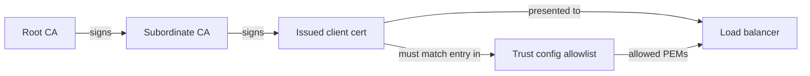

# Trust configs and Private CA

**Certificate Authority Service (CAS)** issues certificates. **Certificate Manager** **trust configs** tell load balancers and TLS front ends **which** client identities to honor. This solution uses **allowlisted leaf certificates** so **lifecycle automation** and **load-balancer behavior** stay aligned—especially where **CRL checking is not in play**.

---

## The problem this design solves (highlight)

- With a **trust anchor only** (CA certificate in the trust config), any **valid** leaf signed by that CA may be **accepted** at the LB.
- **Revoking** that leaf in CAS (and publishing CRL) does **not** always change LB behavior—**many Google Cloud HTTPS / external load balancer paths do not validate client certs against CRLs**.
- **Result:** Operators think a cert is “revoked,” but **clients may still connect** until expiry or a broader config change.

**This solution:** maintain an **explicit list of leaf PEMs** (`allowlistedCertificates`). The LB checks membership in that list. **Automation removes the PEM** on revoke → **immediate deny** at the edge (subject to Certificate Manager propagation), **independent of CRL**.

---

## Allowlist pattern (automation-backed)

After each successful **issue**, the pipeline **appends** the new leaf PEM to the allowlist; on **revoke**, it **removes** the matching PEM (by fingerprint). **Backups** of the full trust config YAML (including allowlist) run **before and after** each run. See [allowlist-lifecycle.md](allowlist-lifecycle.md).

---

## How trust flows (diagram)



With **allowlisting**, the decisive check at the peer is **“is this exact leaf PEM on the list?”**, not merely **“chains to our CA?”**.

---

## Comparison at a glance

| Aspect | Trust anchor emphasis | This solution (allowlist + automation) |
|--------|----------------------|----------------------------------------|
| **What LB trusts** | Typically “certs from this CA.” | **Named leaf PEMs** only. |
| **Revoke in CAS / CRL** | Important for audit; **may not affect LB**. | Still done for audit; **LB** keyed off **allowlist removal**. |
| **Who updates trust** | Often manual or separate process. | **Pipeline** updates YAML via export/edit/import. |
| **Operational backups** | Optional / ad hoc. | **Mandatory BEFORE/AFTER** snapshots to GCS. |

---

## Naming

Default trust config id:

```text
trust-config-<workloadApp>-<workloadEnv>
```

Override with **`TRUST_CONFIG_NAME`** / **`trustConfigName`**.

---

## Root and subordinate CAs (Terraform)

The **root** is `SELF_SIGNED`; the **subordinate** issues day-to-day using the **certificate template** (client auth, SAN rules). **Terraform** owns CA infrastructure; **pipelines** own **leaf lifecycle and allowlist**.

Return to [README](../README.md).
